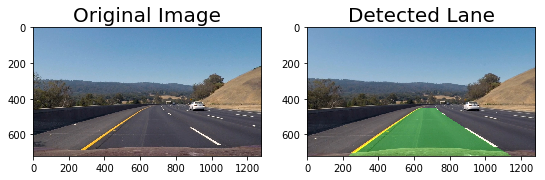

## Advanced Lane Finding

This project was created for the Udacity Self-Driving Car NanoDegree.

You can find the final project in ./Lane-Detection-System.ipynb and the writeup in ./writeup/writeup.md.

The goal was to detect lanes on a highway road from a front facing camera.

